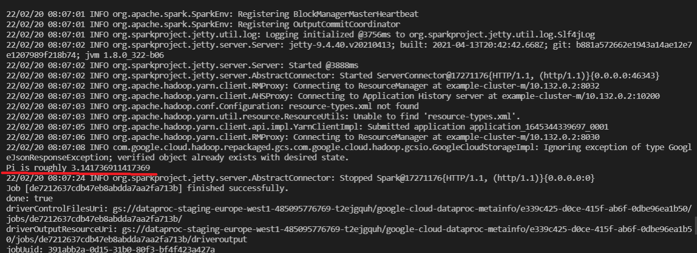
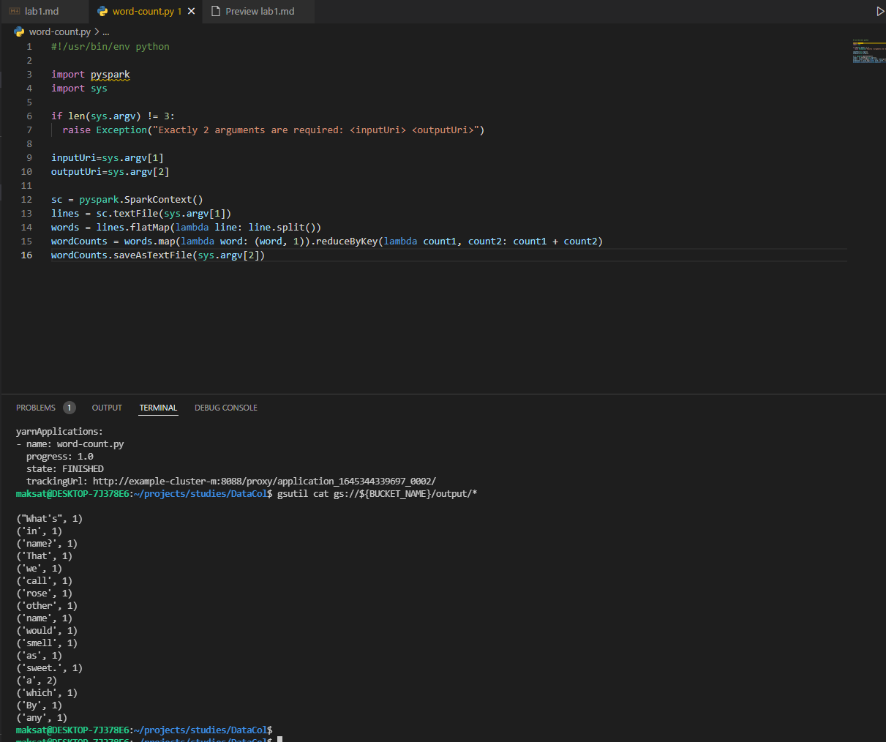
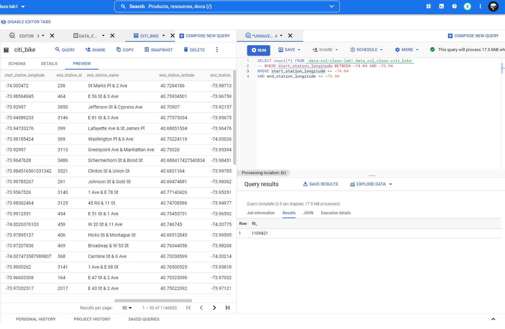
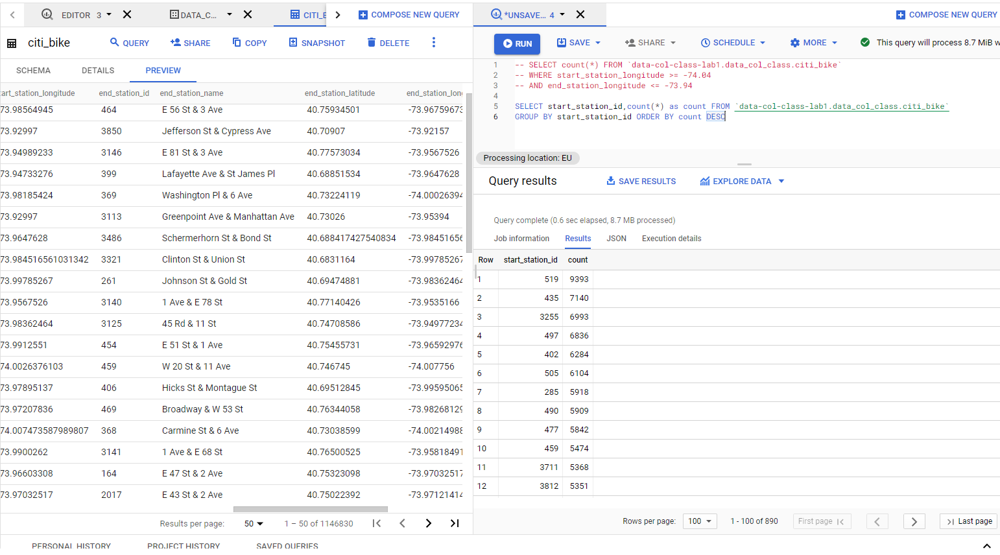
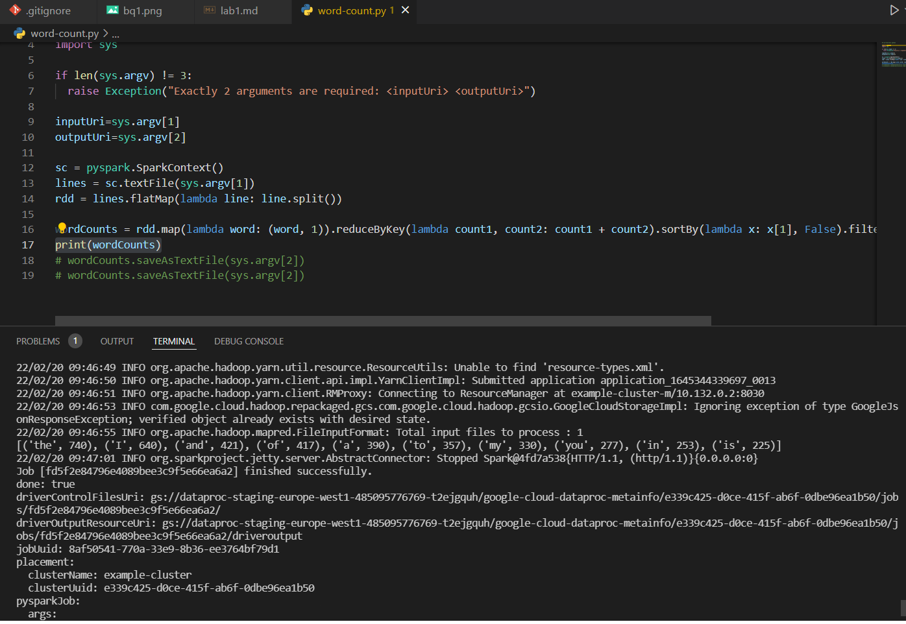
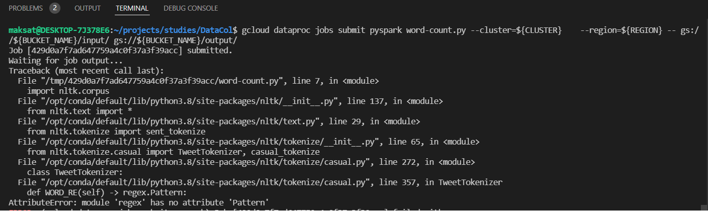

# Lab 1 outputs

## Warm-up exercises 
### 1. Cluster creation and running example job on PI calculation


### 2. Running python script on WordCount example job


### Console history

shell commands:

```console
1192  sudo apt-get install apt-transport-https ca-certificates gnupg
 1193  echo "deb [signed-by=/usr/share/keyrings/cloud.google.gpg] https://packages.cloud.google.com/apt cloud-sdk main" | sudo tee -a /etc/apt/sources.list.d/google-cloud-sdk.list
 1194  curl https://packages.cloud.google.com/apt/doc/apt-key.gpg | sudo apt-key --keyring /usr/share/keyrings/cloud.google.gpg add -
 1195  ls
 1196  curl https://packages.cloud.google.com/apt/doc/apt-key.gpg | sudo apt-key add -
 1197  sudo apt-get update && sudo apt-get install google-cloud-sdk
 1198  gcloud init
 1199  gcloud
 1200  gcloud info
 1201  gcloud dataproc clusters create dataproc-cluster --region=europe-west1-b
 1202  gcloud info
 1203  gcloud beta billing projects describe data-col-class-lab1
 1204  gcloud dataproc clusters create example-cluster --region=europe-west1-b 
 1205  gcloud dataproc clusters create example-cluster --region=regions/europe-west1-b 
 1206  gcloud dataproc clusters create example-cluster --region=europe-west1-d
 1207  gcloud dataproc clusters create example-cluster --region=europe-west1
 1208  gcloud dataproc jobs submit spark --cluster example-cluster     --region=europe-west1      --class org.apache.spark.examples.SparkPi     --jars file:///usr/lib/spark/examples/jars/spark-examples.jar -- 1000
 1209  sudo apt-get install xclip
 1210  gcloud compute ssh example-cluster-m   --project=data-col-class-lab1   --zone=europe-west1-c -- -D 1080 -N
 1211  gcloud dataproc jobs submit pyspark word-count.py     --cluster=${CLUSTER}     --region=${REGION}     -- gs://${BUCKET_NAME}/input/ gs://${BUCKET_NAME}/output/
 1212  PROJECT=data-col-class-lab1
 1213  BUCKET_NAME=dataproc-staging-europe-west1-485095776769-t2ejgquh
 1214  CLUSTER=example-cluster
 1215  REGION=europe-west1 Example: "us-central1"
 1216  REGION=europe-west1
 1217  gcloud dataproc clusters create ${CLUSTER}     --project=${PROJECT}     --region=${REGION}     --single-node
 1218  gsutil cp gs://pub/shakespeare/rose.txt     gs://${BUCKET_NAME}/input/rose.txt
 1219  gcloud dataproc jobs submit pyspark word-count.py     --cluster=${CLUSTER}     --region=${REGION}     -- gs://${BUCKET_NAME}/input/ gs://${BUCKET_NAME}/output/
 1220  gsutil cat gs://${BUCKET_NAME}/output/*
```

## NYC Bike expert

### 1. How many stations with longitude between -73.94 and -74.04? 

1109421



### 2. What’s the total number of bikes available in region_id 71?
*Well, seems that the questions in lab are outdated, because the needed data is not available in the dataset. Idk, if there is a need to check our SQL knowledge :) Original link to the data is not accessible. The data was downloaded from here https://ride.citibikenyc.com/system-data*



### 3. What’s the largest capacity for a station? List all the station_id of the stations that have the largest capacity?

*And again no such columns. Hopefully this task was more about setting up GCD and practicing with Big Query there*

## Understanding William Shakespeare

### 1. Find top 10 frequent words without any text preprocessing

Slightly modified previous code and uploaded shakes.txt taken from http://www.textfiles.com/etext/AUTHORS/SHAKESPEARE/shakespeare-merchant-5.txt

List of top ten words in shakes.txt
```python
[('the', 740), ('I', 640), ('and', 421), ('of', 417), ('a', 390), ('to', 357), ('my', 330), ('you', 277), ('in', 253), ('is', 225)]
```



### 2. ) Find top 10 frequent words by first filtering out stop words provided by NLTK package. The Natural Language Toolkit, or more commonly NLTK, is a suite of libraries and programs to conduct natural language processing in Python

Damn gcloud and cloud stuff xd. There was a known issue with nltk package https://github.com/nltk/nltk/commit/6428c9288a86658cb3d9a1e91816c4bcf162a6f0, which was resolved hovewer google nodes were not updated.



But the could would look like that:

```python
import nltk.corpus
# Import stopwords from nltk.corpus
stop_words = set(nltk.corpus.stopwords.words('english'))
...
# filter out stop words
wordCounts.filter(lambda word: word[0] not in stop_words)
...
```

