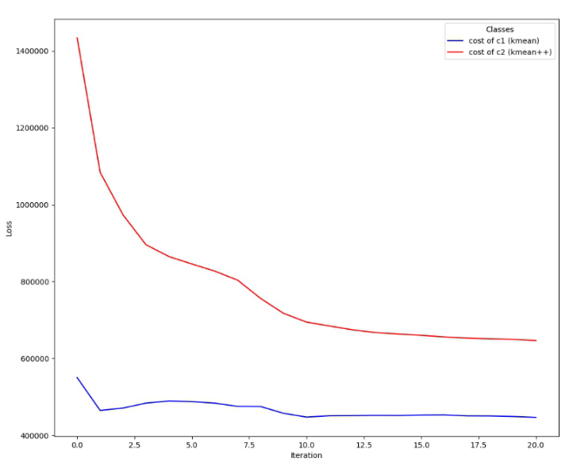
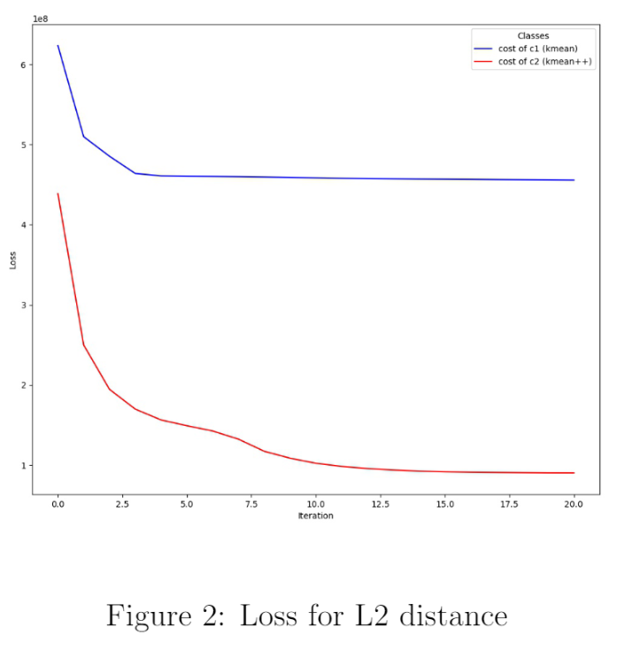
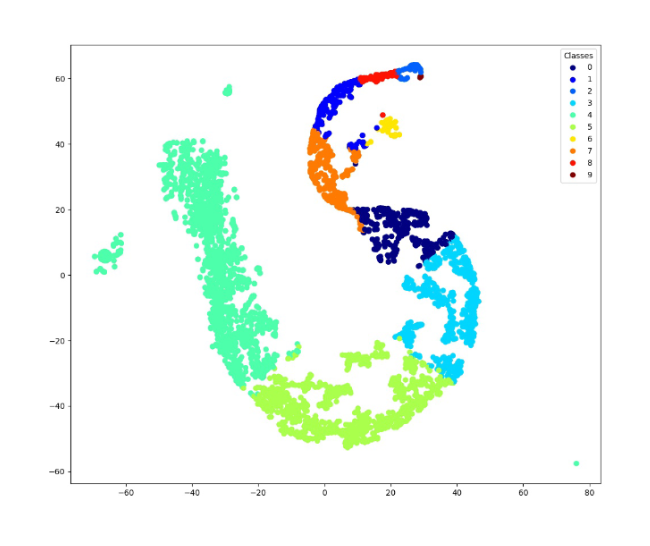
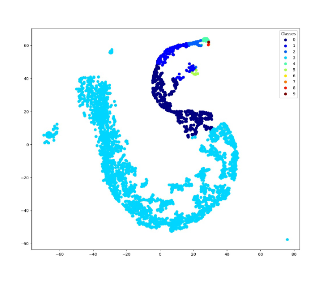
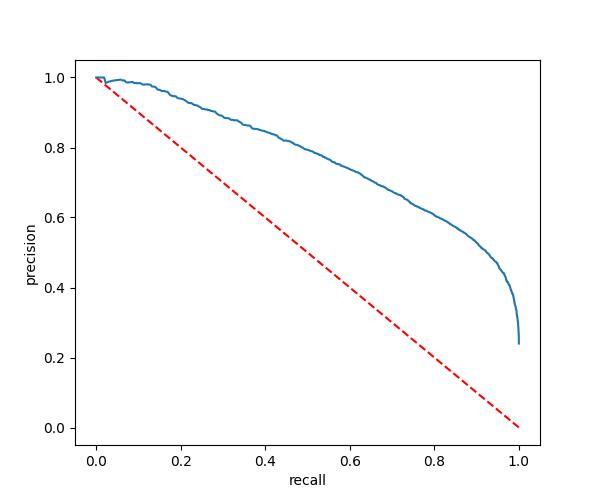
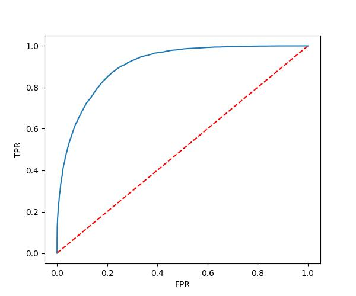

## 1. Iterative K-means clustering on Spark

```console

 PROJECT=data-col-class-lab1
 BUCKET_NAME=dataproc-staging-europe-west1-485095776769-t2ejgquh
 CLUSTER=example-cluster
 REGION=europe-west1
 gcloud dataproc jobs submit pyspark kmeans.py --cluster=${CLUSTER} --region=${REGION} -- gs://${BUCKET_NAME}/data.txt gs://${BUCKET_NAME}/c1.txt gs://${BUCKET_NAME}/c2.txt gs://${BUCKET_NAME}/output

```

### 1.1 Loss for L1 distance


### 1.2 Loss for L2 distance


### 1.3 Kmeans and Kmeans++ clustering visualization





### 1.4 For L1 loss the kmeans++ clustering is not better. However, for L2 loss the kmeans++ clustering redice the loss sharply.

### 1.5 ```O(t*k*n*d)``` where t is the number of iterations, k is the number of clusters, n is the number of data points, and d is the dimension of the data points.

## 2. Monitoring Hadoop metrics

``` console
hadoop@DESKTOP-7J378E6:/usr/local$ hadoop version

Hadoop 3.3.2
Source code repository git@github.com:apache/hadoop.git -r 0bcb014209e219273cb6fd4152df7df713cbac61
Compiled by chao on 2022-02-21T18:39Z
Compiled with protoc 3.7.1
From source with checksum 4b40fff8bb27201ba07b6fa5651217fb
This command was run using /usr/local/hadoop/share/hadoop/common/hadoop-common-3.3.2.jar
```



